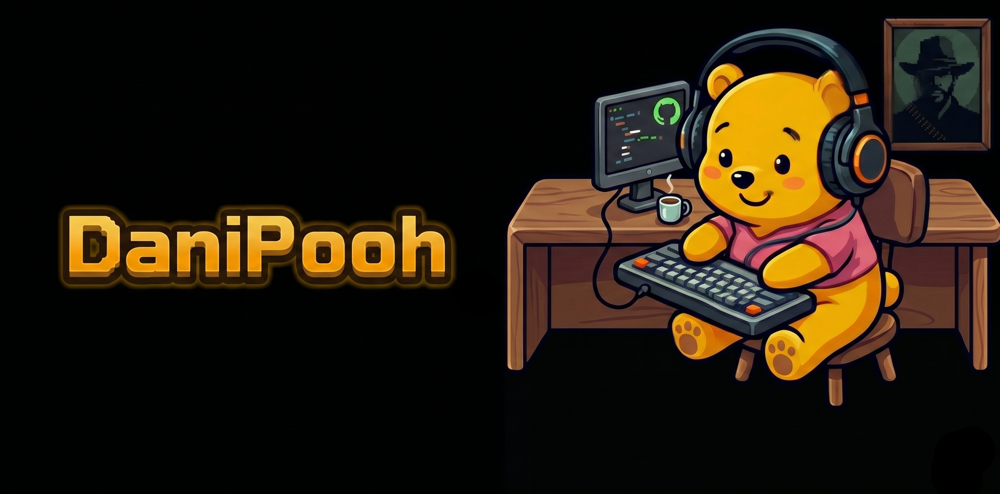

<h3>🐍 Python · 🎮 Game Dev Junior · 🤖 IA</h3>

  
  
  

## 🧠 Sobre mí

Autodidacta desde hace un par de años con Python. Lo que empezó como curiosidad se fue convirtiendo en un camino de aprendizaje constante, construyendo proyectos cada vez más grandes.

La primera parada fue mi juego: **ROGUETHON**, un roguelike ASCII hecho en Python donde realicé la 1.0. Un proyecto que me enseñó sobre lógica, estructuras de datos y lo que realmente implica llevar una idea a código funcionando.

Después llegó el desarrollo web. Construí mi **primera página web con Python** usando Reflex, un proyecto que me permitió entender cómo funcionan las aplicaciones web del lado del servidor, estilizar con CSS y ver el resultado tangible de lo que había aprendido.

Ahora estoy de vuelta en el juego, pero con una mochila mucho más pesada. **Retomé ROGUETHON aplicando todo lo aprendido**, esta vez integrando IA para dar forma a mis ideas de una manera que antes no podía. Mi objetivo es hacer la **versión 2.0**. No uso la IA como muleta, sino como herramienta: siguiendo la metodología de **Gentleman Programming**, al estilo **Tony Stark y Jarvis**, donde yo dirijo y la IA ejecuta, pero el aprendizaje nunca se delega.

## 🛠️ Stack

<h4 align="center">Lenguajes</h4>

  

<h4 align="center">Herramientas</h4>

  

<h4 align="center">IA</h4>

  
  
  

## 🎮 Proyecto destacado

**[ROGUETHON](https://github.com/DaniPooh777/ROGUETHON)** — proyecto personal para aprender a desarrollar un proyecto grande, aplicar lo aprendido en Python y ahora también estoy integrando conocimientos de IA en él.

## 📊 Stats

 

